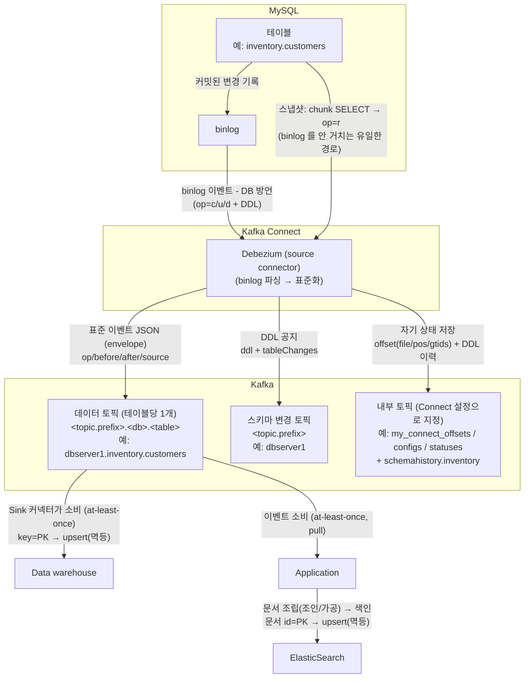

# CDC 전체 그림

```mermaid
flowchart TD
    subgraph A["MySQL"]
        TB["테이블<br/>예: inventory.customers"]
        BL["binlog"]
    end

    TB -->|"커밋된 변경 기록"| BL

    subgraph KC["Kafka Connect"]
        B["Debezium (source connector)<br/>(binlog 파싱 → 표준화)"]
    end

    BL -->|"binlog 이벤트 - DB 방언<br/>(op=c/u/d + DDL)"| B
    TB -->|"스냅샷: chunk SELECT → op=r<br/>(binlog 를 안 거치는 유일한 경로)"| B

    subgraph C["Kafka"]
        T1["데이터 토픽 (테이블당 1개)<br/>&lt;topic.prefix&gt;.&lt;db&gt;.&lt;table&gt;<br/>예: dbserver1.inventory.customers"]
        T2["스키마 변경 토픽<br/>&lt;topic.prefix&gt;<br/>예: dbserver1"]
        T3["내부 토픽 (Connect 설정으로 지정)<br/>예: my_connect_offsets / configs / statuses<br/>+ schemahistory.inventory"]
    end

    B -->|"표준 이벤트 JSON (envelope)<br/>op/before/after/source"| T1
    B -->|"DDL 공지<br/>ddl + tableChanges"| T2
    B -->|"자기 상태 저장<br/>offset(file/pos/gtids) + DDL 이력"| T3

    T1 -->|"Sink 커넥터가 소비 (at-least-once)<br/>key=PK → upsert(멱등)"| D[Data warehouse]
    T1 -->|"이벤트 소비 (at-least-once, pull)"| E[Application]
    E -->|"문서 조립(조인/가공) → 색인<br/>문서 id=PK → upsert(멱등)"| F[ElasticSearch]
```
